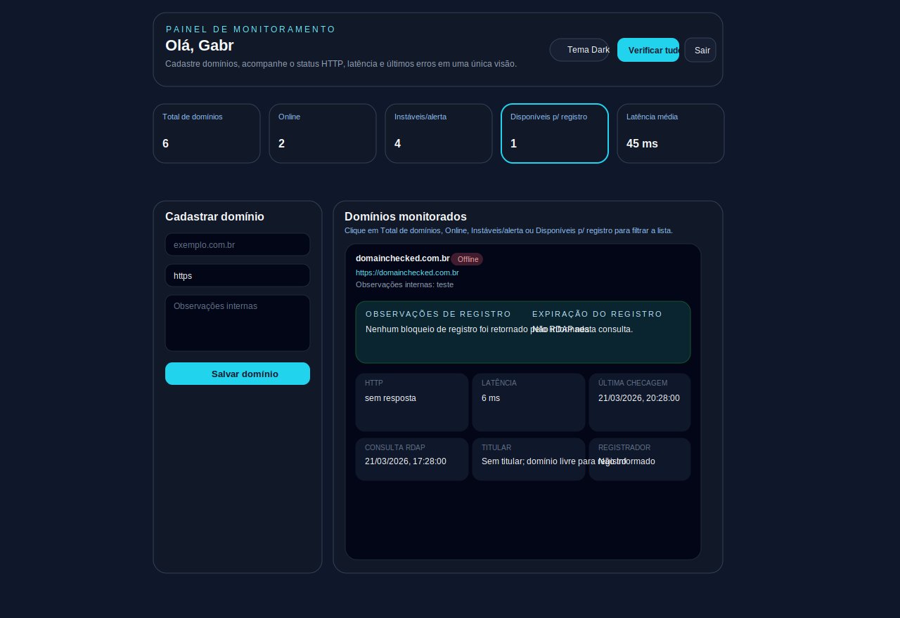

  
  <h1>Domain Checked</h1>
  
Monitoramento de domínios com React, Express, SQLite e checagem contínua de disponibilidade, latência e status de registro.

  

    
    
    
  

## Visão geral

Aplicação full stack com React + Tailwind no front-end e Express + SQLite no back-end para cadastrar domínios, autenticar usuários e verificar o status dos domínios em tempo real por polling.

## Exemplo da interface

A imagem abaixo foi adicionada ao repositório como uma ilustração inspirada no exemplo enviado para destacar a aparência do painel principal.

## Recursos

- Cadastro, login e sessão com JWT.
- Fluxo de esqueci a senha com envio de token de redefinição por e-mail.
- Cadastro e remoção de domínios por usuário.
- Checagem manual e automática dos domínios a cada 30 segundos.
- Consulta RDAP para estimar expiração de registro, registrador e janela de renovação.
- Persistência local em SQLite.
- Interface responsiva com Tailwind CSS.

## Governança do projeto

- **Licença:** [MIT](./LICENSE)
- **Code of Conduct:** [CODE_OF_CONDUCT.md](./CODE_OF_CONDUCT.md)
- **Security Policy:** [SECURITY.md](./SECURITY.md)

## Requisitos

- **Node.js 22 LTS**. O projeto usa `better-sqlite3`, então versões muito novas do Node podem ficar sem binário pré-compilado. No Windows, o Node `25.3.0` costuma cair em build nativo e falhar durante o `yarn install`.
- **Yarn 1.22.22**.
- **Python 3** instalado e disponível no `PATH` apenas se você insistir em usar uma versão do Node sem binário pronto para `better-sqlite3`.

> Recomendação: use Node 22 LTS com Yarn 1.22.22 para evitar compilar dependências nativas.

## Como rodar

1. Copie `.env.example` para `.env` e preencha as variáveis SMTP para envio do token de recuperação.
2. Se você usa `nvm`, rode `nvm use` para carregar a versão definida em `.nvmrc`.
3. Ative o Corepack com `corepack enable` se necessário.
4. Instale dependências com `yarn install`.
5. Rode `yarn dev`.

A API sobe em `http://localhost:3001` e o front-end em `http://localhost:5173`.

### Configuração de e-mail para recuperação de senha

Preencha as variáveis abaixo no arquivo `.env` para que o endpoint `/api/auth/forgot-password` envie o token de recuperação por e-mail:

- `SMTP_HOST`: host do servidor SMTP.
- `SMTP_PORT`: porta SMTP, normalmente `587` ou `465`.
- `SMTP_SECURE`: use `true` para SSL/TLS direto, `false` para STARTTLS.
- `SMTP_USER`: usuário/autenticação da conta de envio.
- `SMTP_PASS`: senha ou token SMTP.
- `SMTP_FROM`: remetente exibido no e-mail.

O token de recuperação gerado pelo back-end agora usa **66 caracteres** e não é mais exibido na interface.

## Se o Corepack não conseguir baixar o Yarn

Em alguns ambientes, o comando `yarn` é fornecido pelo **Corepack**. Nesses casos, o Corepack tenta baixar o Yarn Classic antes de executar qualquer coisa. Se sua rede, proxy ou firewall bloquear esse download, você pode ver um erro parecido com:

- `Error when performing the request to https://registry.yarnpkg.com/yarn/-/yarn-1.22.22.tgz`
- `Proxy response (403) !== 200 when HTTP Tunneling`

Se isso acontecer, mantenha o fluxo com Yarn e instale o **Yarn Classic 1.22.22** por outro caminho disponível no seu ambiente, por exemplo:

1. `npm install -g yarn@1.22.22`
2. `yarn install`
3. `yarn dev`

O projeto continua versionado com `yarn.lock` e `packageManager: yarn@1.22.22`.

## Erro no Windows com `better-sqlite3`

Se o `yarn install` falhar com uma mensagem parecida com `No prebuilt binaries found` e `gyp ERR! find Python`, isso normalmente significa que você está usando uma versão do Node nova demais para o binário publicado do `better-sqlite3`.

### Correção recomendada

1. Instale ou selecione o **Node 22 LTS**.
2. Apague `node_modules` e qualquer arquivo de lock gerado parcialmente.
3. Rode `yarn install` novamente.

### Alternativa

Se você realmente precisar manter outra versão do Node, instale o Python 3 e as ferramentas de build do `node-gyp`, depois configure o caminho do Python para o npm. Ainda assim, a opção mais estável para este projeto é usar Node 22 LTS.
